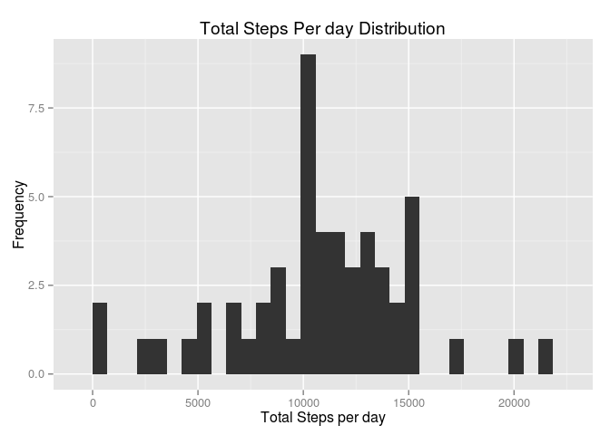
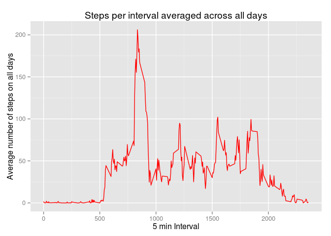
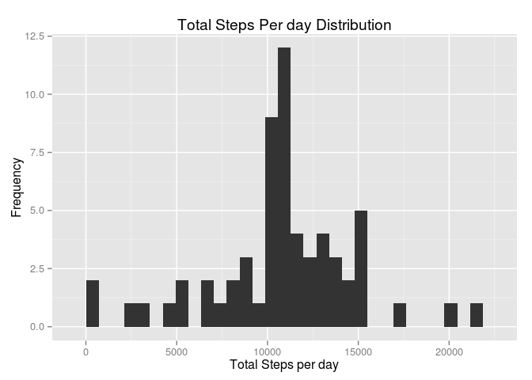
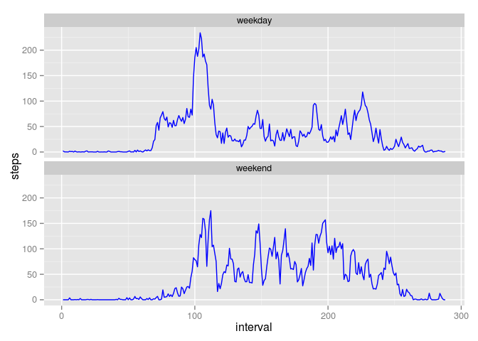

# Reproducible Research: Peer Assessment 1


## Loading and preprocessing the data
Loading the csv

```r
unzip(zipfile = "./activity.zip")
data <- read.csv("./activity.csv")
data$interval <- as.factor(data$interval)
head(data)
```

```
##   steps       date interval
## 1    NA 2012-10-01        0
## 2    NA 2012-10-01        5
## 3    NA 2012-10-01       10
## 4    NA 2012-10-01       15
## 5    NA 2012-10-01       20
## 6    NA 2012-10-01       25
```

## What is mean total number of steps taken per day?

Calculating total steps wrt dates and plotting a histogram

```r
stepsPerDay <- aggregate(steps ~ date,data,sum)

library(ggplot2)
qplot(stepsPerDay$steps,xlab="Total Steps per day",main = "Total Steps Per day Distribution",
      ylab ="Frequency" )
```

 

Mean & Median

```r
mean(stepsPerDay$steps)
```

```
## [1] 10766.19
```

```r
median(stepsPerDay$steps)
```

```
## [1] 10765
```

## What is the average daily activity pattern?

```r
averages <- aggregate(data$steps, by = list(interval = data$interval),mean,na.rm=TRUE)
colnames(averages) <- c("interval","steps")
averages$interval <- as.integer(levels(averages$interval))
ggplot(data = averages, aes(x = interval, y = steps)) + geom_line(color="red") + xlab("5 min Interval") + ylab("Average number of steps on all days") +ggtitle("Steps per interval averaged across all days")
```

 

Max steps occured on 

```r
intervalObservedMax <- averages[which.max(averages$steps),]
print(intervalObservedMax)
```

```
##     interval    steps
## 104      835 206.1698
```
## Imputing missing values

Total missing values

```r
sum(is.na(data$steps))
```

```
## [1] 2304
```

Fill na values with steps averaged on all days per interval

```r
library(data.table)
indexOfNAValues <- which(is.na(data$steps))
interval <- data[indexOfNAValues,]$interval
avg <- data.table(averages)
replaceValueSteps <- unlist(lapply(interval,function(inter){avg[avg$interval == inter]$steps}))
filledDataSteps <- data$steps
filledDataSteps[indexOfNAValues] <- replaceValueSteps
filledData <- data.frame(interval = data$interval,steps = filledDataSteps, date = data$date)
str(filledData)
```

```
## 'data.frame':	17568 obs. of  3 variables:
##  $ interval: Factor w/ 288 levels "0","5","10","15",..: 1 2 3 4 5 6 7 8 9 10 ...
##  $ steps   : num  1.717 0.3396 0.1321 0.1509 0.0755 ...
##  $ date    : Factor w/ 61 levels "2012-10-01","2012-10-02",..: 1 1 1 1 1 1 1 1 1 1 ...
```

checking imputting

```r
sum(is.na(filledData$steps))
```

```
## [1] 0
```

```r
newData <- aggregate(steps ~ date,filledData,sum)
qplot(newData$steps,xlab="Total Steps per day",main = "Total Steps Per day Distribution",
      ylab ="Frequency" )
```

 

```r
mean(newData$steps)
```

```
## [1] 10766.19
```

```r
median(newData$steps)
```

```
## [1] 10766.19
```


## Are there differences in activity patterns between weekdays and weekends?
Difference in patterns between weekdays and weekends

```r
  data <- data.table(data)
  data$weekday <- as.factor(weekdays(as.Date(data$date)))

  weekendData <- data[data$weekday %in% c("Saturday","Sunday")]
  weekdayData <- data[!data$weekday %in% c("Saturday","Sunday")]

  aggWeekend <- aggregate(weekendData$steps,by = list(interval = weekendData$interval),mean,na.rm=TRUE)
  aggWeekday <- aggregate(weekdayData$steps,by = list(interval = weekdayData$interval),mean,na.rm=TRUE)

  aggWeekend$weekFactor <- rep("weekend",nrow(aggWeekend))
  aggWeekday$weekFactor <- rep("weekday",nrow(aggWeekday))

  dataByWeekday <- rbind(aggWeekend,aggWeekday)
  colnames(dataByWeekday) <- c("interval","steps","weekFactor")
  dataByWeekday$weekFactor <- as.factor(dataByWeekday$weekFactor)
  dataByWeekday <- data.table(dataByWeekday)
  dataByWeekday$interval <- as.integer(dataByWeekday$interval)
```


```r
  g <- ggplot(dataByWeekday, aes(x=interval,y=steps))
  g + geom_line(color="blue")+facet_wrap(~weekFactor,nrow=2,ncol=1)
```

 
